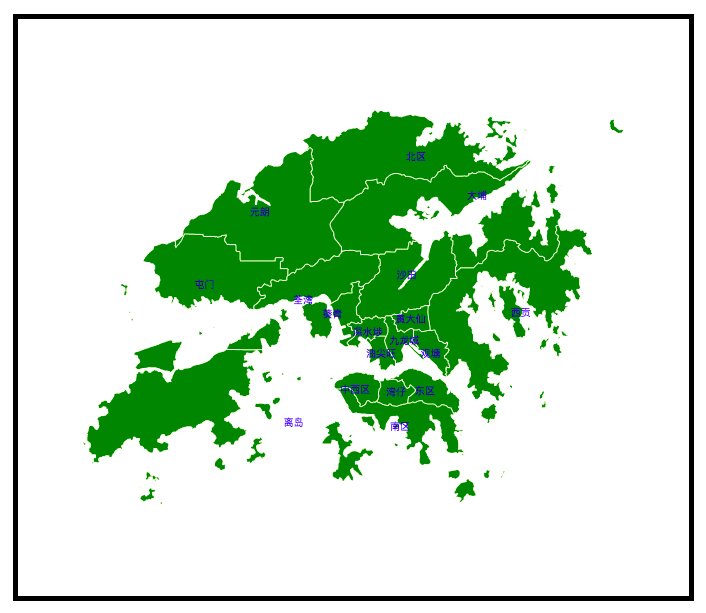

# map
地图组件，包括自适应尺寸和中心位置并可以交互的地图。

<p align='center'></p>

<p>
  <a href="https://hai2007.gitee.io/npm-downloads?interval=7&packages=@clunch/map"></a>
  <a href="https://www.npmjs.com/package/@clunch/map"></a>
  <a href="https://github.com/clunch-contrib/map/graphs/commit-activity" target='_blank'></a>
  <a href="https://github.com/clunch-contrib/map/blob/master/LICENSE"></a>
  <a href="https://github.com/clunch-contrib/map" target='_blank'></a>
</p>

## 如何使用？

首先，需要安装npm包（目前我们仅支持npm方式管理）：

```
npm install --save clunch @clunch/map
```

然后注册组件：

```js
import Clunch from 'clunch';
import map from '@clunch/map';

Clunch.series('ui-map',map);
```

然后，你就可以使用这个组件了：

```html
<ui-map geo-json='json'/>
```

- geo-json:[Geo JSON](https://geojson.org/)数据。

除了上面的必输项外，还有下列可选项：

|属性|类型|描述|默认值|可选值|
|----|----|----|----|----|
|cx|number|图中心横坐标|画布中心横坐标||
|cy|number|地图中心纵坐标|画布中心纵坐标||
|width|number|地图的宽|画布的宽||
|height|number|地图的高|画布的高||
|fill-color|string \| function|区域填充色|green||
|stroke-color|string \| function|区域轮廓色|white||
|font-color|string|文字颜色|blue||
|type|string|区域绘制方法|full|fill \| full \| stroke|
|scale||number|地图缩放倍数|默认自动给出一个最佳值|
|center|Array<number,number>|地图中心经纬度|默认自动给出一个最佳值||

### GeoJSON数据

一种对各种地理数据结构进行编码的格式，基于Javascript对象表示法(JavaScript Object Notation, 简称JSON)的地理空间信息数据交换格式。

我们这里支持的类型可以是```Feature```或```FeatureCollection```。

```js
// Feature
{
    "type": "Feature",
    "properties": {
        "name": "",
        "cp": [],
    },
    "geometry": {
        "type": "Polygon | MultiPolygon",
        "coordinates": []
    }
}
```

```js
// FeatureCollection
{
    "type": "FeatureCollection",
    "features": [
    // 数组的类型是Feature
    ]
}
```

> 温馨提示：GeoJSON数据你只需要知道我们支持这两种格式即可，具体的数据应该来自下载或地理网站等。

### 动态颜色
对于上面的配置项`fill-color`和`stroke-color`而言，除了直接传递一个颜色字符串外，还可以传递一个函数，返回最终的颜色值，函数定义如下：

```js
methods:{
    calcColor(properties,index){
        // properties表示当前Feature中的properties值
        // index表示FeatureCollection类型是数据类型中features中的下标，如果是Feature类型，值一直为0
    }
}
```

由于此组件是基于[Clunch](https://github.com/hai2007/clunch)开发的，我们默认你已经掌握了相关知识。

[<< 你可以点击此处学习Clunch.js如何使用](https://hai2007.gitee.io/clunch/#/course/introduce?fixed=top)

## 交互事件

图形绘制完成以后，我们可能还需要图形是可交互的，比如鼠标点击某个条目，可以提示对应的信息。

那么，我们可以对```.clunch```改造一下：

```html
<ui-map c-on:click='doit'/>
```

然后，在```new Clunch```的时候添加```doit方法```：

```js
new Clunch({
    ......
    methods:{
        doit(target){
            console.log(target);
        }
    }
});
```

打印的结果如下：

```js
target = {
    attr:当前组件的属性值
    data:你点击区域的信息
    left:点击位置的横坐标
    top:点击位置的纵坐标
    region:点击区域名称
    subRegion:点击子区域名称
    ......
}
```

其中，target.subRegion的格式举例子：```1```点击第二个区域。

这样子，你就可以添加弹框或者悬浮提示来实现和绘制图形的交互了！

开源协议
---------------------------------------
[MIT](https://github.com/clunch-contrib/map/blob/master/LICENSE)

Copyright (c) 2021 [hai2007](https://hai2007.gitee.io/sweethome/) 走一步，再走一步。
